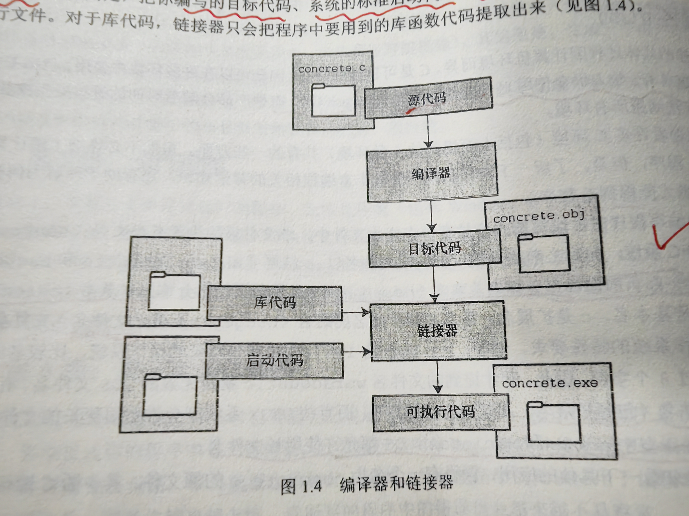
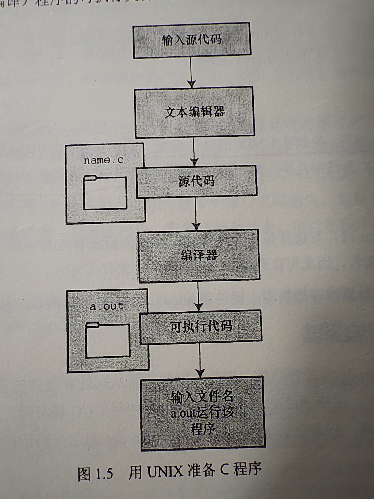

## 选择C语言
### 高效性
*具有汇编语言*（为特殊的中央处理单元（CPU）设计的一系列内部指令，不同的CPU系列使用不同的汇编语言）*才有的微调控制能力*（即根据具体情况以获得最大运行速度或最有效地使用内存）。

### 可移植性
在一种系统编写的C语言可以稍作修改或不修改就能在其他系统运行。

### 强大而灵活
UNIX操作系统，其他语言的许多编译器和解释器都是用C语言编写的。在UNIX即上使用FORTAN时，最终都是由C程序生成最后的可执行程序。

## C语言的应用范围
-  是嵌入式系统编程的流行语言（汽车，照相机，DVD播放机，等都用C语言进行编程）
- C++在C语言的基础上嫁接了面向对象编程工具。（面向对象编程通过对语言建模来适应问题，而不是对问题建模以适应语言）
- 在linux开发中扮演着及其重要的角色

## 计算机能做什么
### 了解一下计算机工作原理
#### 设备
中央处理单元（CPU）：绝大部分运算工作（处理程序）
RAM（随机存取内存）：存储文件和程序的工作区
...
#### 工作原理
- CPU的工作：
    从内存中获取并执行一条指令，然后再获取下一条并执行，CPU有自己的小工作区——由若干个寄存器组成，每个寄存器可以存储一个数字。一个寄存器存储下一条指令的内存地址，CPU利用该地址来获取和更新下一条指令。在获取指令后CPU在另一个存储器存储该指令，并更新前面那个寄存器存下一条地址。
- 其他：
	- 存储在计算机中的所有内容都是数字。
	- 计算机程序最终都是以数字指令码（机器语言）来表示。	
简而言之：你教计算机做事
举个例子：
- 从内存位置2000上把一个数字拷贝到寄存器1上。
- 从内存位置2004上把另一个数字拷贝到寄存器2上。
- 把2和1上的内容相加，结果存到1中（指令）。
- 把1的内容存到内存位置2008。

## 高级语言和编译器
- 编译器
	作用：把高级语言程序翻译成计算机能理解的机器语言指令集的程序。
	优势：不同CPU制造商使用的指令系统和编码格式不同（机器语言不互通），用合适的编译器转换高级语言就可以转换成合适的机器语言执行。
## 语言标准
### 第一个ANSI/ISO C标准
前面是C89，后面是C90（1989，1990）

### C99标准
1994，

### C11 标准
2011，

## 使用C语言的7个步骤

### 第一步 ：定义程序的目标
不涉及具体的计算机语言，你的程序需要什么信息，要进行哪些计算和控制，程序要报告哪些信息。

### 第二步：设计程序
- 思考如何用程序实现，例如，用户界面应该是怎样的？如何组织程序？目标用户是谁？准备花多少时间？
- 决定如何表示数据，用什么方法处理数据
- 用术语描述代码！！
### 第三步：编写代码
创建源代码

### 第四步：编译

### 第五步：运行程序
传统意义上，可执行文件是可运行的程序。
常见环境，
- 要输入可执行文件的文件名，（windows命令提示符模式，UNIX终端，Linux终端模式）
- 还需要运行命令或其他机制（VAX中的VMS），例如，windows和Macintosh提供的集成开发环境（IDE）中，用户可以在IDE中通过选择菜单中的选项或按下特殊键来编辑和执行C程序。最终生成的程序可以通过单击或双击文件名或图标直接在操作系统中运行。
VAX是一种可支持机器语言和虚拟地址的32位小型计算机
VMS是旧名，现在叫Open VMS，一种用于服务器的操作系统，可在VAX等小型处理器系列上运行。
### 第六步：测试和调试程序

查找并修复程序错误的过程叫调试。

### 第七步：维护和修改代码

## 编程机制
用C语言编写程序时，编写的内容被存储在文本文件中，该文件被称为源代码文件。文件名中.c前面的部分被称为基本名，点号后面的时扩展名，两个加起来就是文件名。
### 目标代码文件，可执行文件，库
- 可执行文件（包含可直接运行的机器语言代码），通过编译和链接实现，编译器把源代码转化成中间文件，链接器将中间代码与其他代码合并，链接器还会将编写的程序和预编译的库代码合并。
- 中间文件，有很多种形式。其中一种，将源代码转化为机器语言代码，并将结果放在目标代码文件中。该目标代码文件不能直接运行，因为那是编译器翻译的源代码，不是一个完整的程序。
- 目标代码文件缺失启动代码，启动代码充当程序和操作系统之间的接口。
- 还缺库函数，例如：printf()函数真正的代码在库函数中。
- 链接器的作用就是。把编写的目标代码，系统的标准启动码和库代码这三个部分合并成一个文件，即可执行文件。（链接器只会把要用到的库函数代码提取出来）

### UNIX系统
#### 在UNIX系统上编辑
UNIX C没有自己的编辑器，但是可以使用通用的UNIX编辑器，如：emacs，jove，vi，或X windows system文本编辑器。区分大小写。

#### 在UNIX系统上编译
输入 cc inform.c

~~~C
//inform.c 文件
# include <stdio.h>
int main(void)
{
	printf("A .c is used to end a C program filename.\n");

	return 0;
}
~~~
链接器合成的文件是一个新的文件，原来的文件会被自动删掉。

### GNU编译器集合和LLVM项目
- GNU项目始于1987年，是一个开发大量自由UNIX软件的集合(GNU‘s Not UNIX)。GNU编译器集合（也称GCC，其中包含GCC C编译器）是该项目的产品之一。gcc的系统都用cc作为gcc的别名。
- LLVM项目成为cc的另一个替代品，
### linux系统
linux是一个开源，流行，类似UNIX的操作系统，可在不同的平台（包括PC和Mac）上运行。在linux中准备C程序与在UNIX系统几乎一样，不同的是要使用GCC公共域C编译器。
编译命令为：gcc inform.c
注：在安装linux是可选择是否安装GCC，如果之前没有安装GCC，则必须安装。通常，安装过程会将cc作为gcc的别名，因此可以在命令行中使用cc代替gcc。
### PC的命令行编译器
- C编译器不是标准windows软件包的一部分，因此需要从别处获取并安装C编译器，可以下载Cygwin和MinGW，这样便可以在PC上通过命令行使用GCC编译器。
- 源代码文件应该是文本文件，不是字处理软件（包括其他内容，例如字体，格式等）。因此，要用文本编辑器来编辑源代码。若用字处理器，要以文本形式另存，扩展名为.c,如果不是，则换成.c.
- C编译器生成的通常是.obj文件（也可能是别的）有的要手动删，合成前的那些文件，有的链接器会自动删。
### 集成开发环境（Windows）
许多供应商都提供windows下的集成开发环境，或称为IDE（VS2022就是）。可以运行程序的多种环境。

### Windows/linux
许多linux发行版都可以安装在Windows系统中，以创建双系统。不能通过W访问L，但是可以通过L访问W。

### Macintosh中的C
苹果提供Xcode开发系统下载

## 其他
将高级语言转换成机器语言，采用编译和解释两种方法。