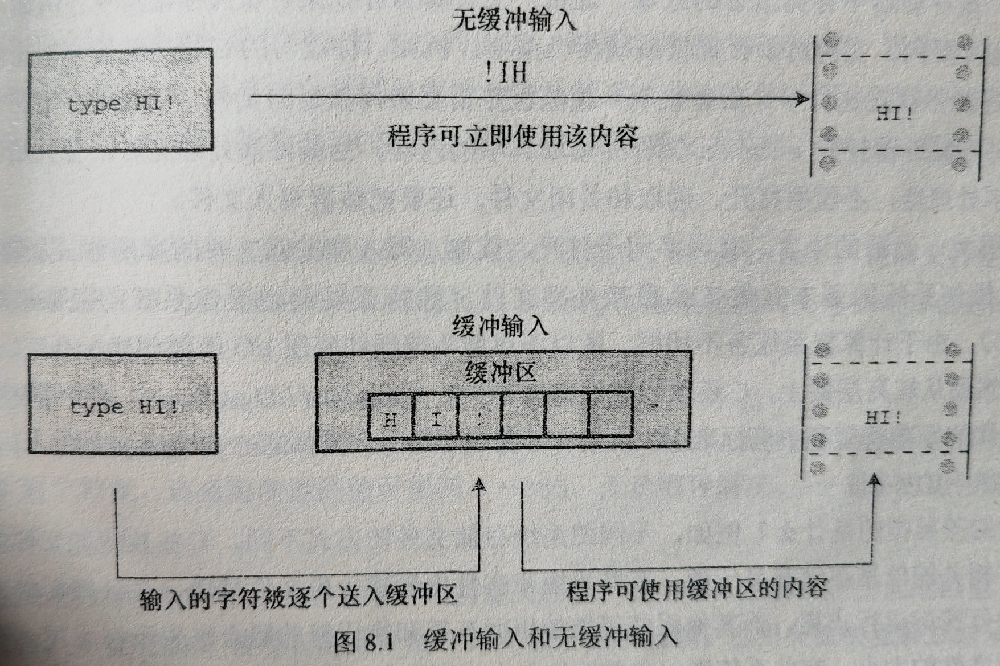
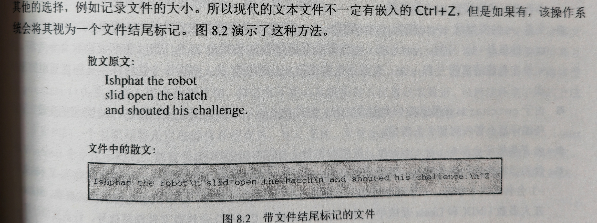
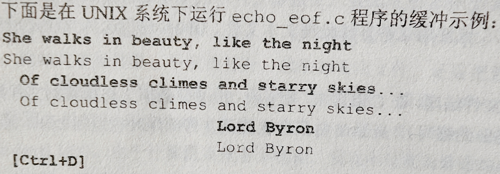
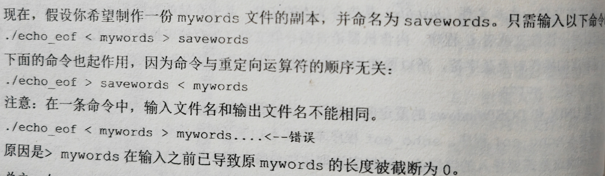
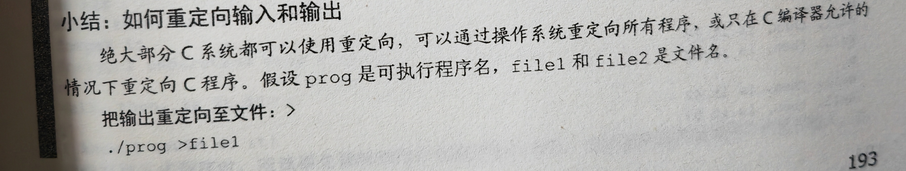
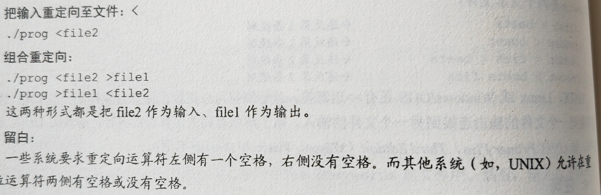

## 缓冲区（buffer）
~~~C
# include <stdio.h>
int main()
{
	char ch;

	while ((ch = getchar()) != '#')
		putchar(ch);
	return 0;
}
~~~
无缓冲/直接 输入：正在等待的程序可以立即使用输入的字符
例如上述程序输入时可能是下述情况：

缓冲输入：用户按下enter键之前不会重复打印。
用户输入的字符被收集并存储在一个被称为缓冲区的临时存储区，按下enter键之后程序才可使用用户输入的字符。

缓冲：
- 完全缓冲I/O：当缓冲区被填满时才刷新缓冲区（内容被发送至目的地）
- 行缓冲I/O:出现换行符时刷新缓冲区。键盘输入通常是行缓冲输入，所以在按下enter键后才刷新缓冲区
使用无缓冲输入，ANSI C 将缓冲输入作为标准。
如果要使用无缓冲输入，不同计算机系统设定不一样，如：IBM PC兼容机的编译器为支持无缓冲输入提供了一系列函数

### 标准的输入输出（stdin，stiout）

标准的输入：从键盘上输入东西
标准输出：输出内容显示在显示屏上

## 结束键盘输入
### 文件，流和键盘输入
#### 文件
解释：存储器中存储信息的区域。
	通常文件都保存在某种永久存储器中（例如，硬盘，U盘，DVD等），编写的程序，编译C程序的程序都保存在文件中。
- 底层I/O：直接调用操作系统的函数，即使用主机操作系统的基本文件工具直接处理文件。
计算机系统各不相同，不可能为普通的底层I/O函数创建标准库，然而从较高层面上可以通过标准I/O包来处理文件，涉及创建用于处理文件的标准模型和一套标准I/O函数。

#### 流
解释：实际输入或输出映射的理想化数据流。
	从概念上看，C程序处理的是流而不是直接处理文件，不同属性和不同种类的输入，由属性更统一的流来表示，于是，打开文件的过程就是把流与文件相关联，而且读写都通过流来完成。

可以把输入和输出设备视为存储设备上的普通文件，尤其是把键盘和显示设备视为每个C程序自动打开的文件。printf（），scanf（）等都是标准I/O包中的成员。
### 文件结尾
#### 检测文件结尾的方法
1. 在文件末尾放一个特殊的字符标记文件结尾。
	CP/M，IBM/DOS，MS/DOS的文本文件曾用过这种方法，如今可以使用内嵌的ctrl+Z来标记文件末尾，现在还可以用来记录文件大小，
	
2. 存储文件大小的信息
即，如果文件有3000字节大小，程序在读到3000字节是便达到文件的末尾。MS/DOS及其相关系统使用这种方法处理二进制文件，因为使用这种方法可以在文件中存储所有的字符，包括ctrl+Z

#### EOF
##### 介绍
无论操作系统使用何种方法检测文件结尾，在C语言中，用getchar（）读取文件检测到文件结尾时将返回一个特殊的值，即EOF（end of file）scanf（）函数检测到文件结尾时也返回EOF，EOF被定义在stdio.h文件中。
~~~
 #define EOF（1）
 ~~~
 getchar（）函数的返回值通常介于0-127，这些值对应标准字符集。如果系统能识别扩展字符集就介于0-255，无论哪种，-1都不对应任何字符。
 注：*EOF* 是一个值，标志检测到文件结尾，并不是在文件中找得到的符号。
##### 使用
~~~
while ((ch = getchar()) != EOF)
~~~
绝大部分系统都有办法键盘模拟文件结尾条件。
~~~C
# include <stdio.h>
int main()
{
	char ch;

	while ((ch = getchar()) != EOF)
		putchar(ch);
	return 0;
}
~~~
*注：* 
1. 不用定义EOF，stdio.h文件中有
2. 不用担心EOF的实际值，头文件中有，不必再编写代码假定EOF为某值
3. 由于getchar（）函数的返回值是int类型，将其赋给char类型一些编译器会警告可能丢失数据。
4. 使用该程序进行键盘输入，不能只输入字符EOF，也不能只输入-1（这是两个字符）。再UNIX和Linux系统中，在一行开始处按下ctrl+D会传输文件结尾信号，许多微型计算机系统都把一行开始处的ctrl+Z识别为文件结尾信号，一些系统把任意位置的ctrl+Z解释成文件结尾信号。
 
 windows ctrl+z结束
 每次按下enter键处理一次
##### 模拟EOF和图形界面
	模拟EOF的概念是在使用文本界面的命令行环境中产生的。在这种环境中，用户通过击键与程序交互，由操作系统生成EOF信号。但是在一些实际应用中，却不能很好地转换成图形界面(如 Windows 和Macintosh),这些用户界面包含更复杂的鼠标移动和按钮点击。程序要模拟EOF的行为依赖于编译器和项目类型。例如，Ctrl+Z可以结束输入或整个程序，这取决于特定的设置。

## 重定向和文件

	上面的代码，输入设备是键盘，输入数据流由字符组成。假设你希望输入函数和数据类型不变，仅改变程序查找数据的位置。那么，应该去哪查找输入？
	在默认情况下，C程序使用标准I/O包查找标准输入作为输入源。这就是stdin流，它是把数据读入计算机的常用方式。它可以是磁带，穿孔机或电传打印机或者是（假设）键盘，甚至是语音输入。除去这些可以让计算机到别处查找输入。尤其是可以让一个程序从文件中查找输入。
使用文件的方法：
- 显式使用特定的函数打开文件，关闭文件，读取文件，写入文件，诸如此类。
- 设计能与键盘和屏幕互动的程序，通过不同的渠道*重定向* 输入至文件和从文件输出。即，把stdin流重新赋给文件。继续使用你getchar（）函数从输入流中获取数据，但它并不关心从流的什么位置获取数据。
重定向与操作系统有关，与C无关

### UNIX，Linux和DOS重定向
在命令行提示里进行（不同操作系统中的不一样）
重定向输入让程序使用文件而不是键盘来输入，重定向输出让程序输出至文件而不是屏幕。
#### 重定向输入
假设已经编译了echo_eof.c程序，并生成了一个名为echo_eof（或者在Windows系统中名为echo_eof.exe）的可执行文件。运行该程序，输入可执行文件名：
./ echo_eof
该程序的运行情况和前面一样，获取用户从键盘输入的输入。现在，假设要用该程序处理名为words的文本文件。
- 文本文件是内含文本的文件，其中存储的数据是我们可识别的字符。文件内容可以是一篇散文或者C程序。内含机器语言指令的文件不是文本文件。
由于该程序的操作对象是字符，使用文本文件，用下面命令代替
~~~
./echo_eof < words
~~~
<符号是UNIX和DOS或Windows的重定向运算符。该文件使words文件与stdin流相关联，把文件中的内容导入echo_eof程序。该程序本身并不知道（或不关心）输入的内容是来自文件还是键盘，他只知道这是需要导入的字符流，所以他读取这些内容并把字符逐个打印在屏幕上，直至读到文件结尾
[重定向演示](https://www.bilibili.com/video/BV17E411s7dh/?spm_id_from=333.337.searchcard.all.click&vd_source=d89b1f9ebed03fcd0246aac88041cb6c)

< 是输入的意思，>是输出的意思

#### 重定向输出
假设要用echo_eof把键盘输入的内容发送到名为mywords的文件中

#### 组合重定向
- 一条命令中输入的文件名和输出的文件名不可以相同
- 命令与重定向运算符的顺序无关

另外：还有>>运算符，该运算符可以把数据添加到现有文件的末尾，而|运算符能把一个文件的输出连接到另一个文件的输入，等等。

#### 注释
重定向让我们能使用键盘输入程序文件
重定向是一个命令行概念，因为我们要在命令行输入特殊的符号发出指令，不使用命令行也可以使用重定向.
Microsoft Visual Studio的默认设置是把可执行文件放在项目文件夹的子文件，称为Debug。文件名与项目名的基本名相同，文件名的扩展名为.exe。
Xcode在给项目命名之后才能命名可执行文件，并将其放在Debug文件夹中，在UNIX系统中，可以通过Terminal工具运行可执行文件。

小结：

## 创建更友好的用户界面
### 使用缓冲输入
又名：猜谜程序的改进
~~~C
#include<stdio.h>

int main()
{
	int guess = 1;

	printf("Pick an integer from 1 to 100. I will to guess it.\n");
	printf("Respond with a y if my guess is right an n if it is wrong.\n");
	printf("Uh...is your number %d?\n", guess);

	while (getchar() != 'y')
		printf("Well, then,is it %d?\n", ++guess);
	printf("I knew I could do it!\n");

	return 0;
}
~~~

~~~
Pick an integer from 1 to 100. I will to guess it.
Respond with a y if my guess is right an n if it is wrong.
Uh...is your number 1?
n
Well, then,is it 2?
Well, then,is it 3?
y
I knew I could do it!
~~~
问题：
- 每次输入n，程序打印两条消息，因为n作为用户否定了数字“1”，还读取了一个换行符否定了“2”.
改：使用while循环丢弃最后剩余的内容包括换行符。
~~~C
while(getchar() != 'y')
{
	printf("Well,then,is it %d?\n",++guess);
	while(getchar() != '\n')
		continue;
}
~~~

问题：会把除y之外的所有字母当作n
用if筛选
~~~C
while(getchar() != 'y')
{
	if(response == 'n')
		printf("Well,then,is it %d?\n",++guess);
	else
		printf("Sorry,I understand only y or n.\n");
	while(getchar() != '\n')
		continue;       //跳过剩余的行
}
~~~

### 混合数值和字符输入
scanf（）和getchar（）不能混用，因为scanf（）读取时会自动跳过空格等。而getchar不会。

## 输入验证
用户的输入和程序不匹配的情况经常发生。
1. 假如你编写了一个处理非负整数的循环，但是用户很可能输入一个负数。可以使用关系表达式来排除这种情况
~~~C
long n;
scanf("%ld", &n);
while(n >= 0)
{
//处理n
	scanf("%ld", &n);//获取下一个值
}
~~~
2. 输入错误类型的值，可以通过检查scanf（）的返回值来检测。也可以友好的告诉用户他错了，放在一个函数中。

该函数把一个long类型的值读入变量input中如果读取失败，函数进入while（）循环体，然后内层循环逐字符的读取错误的输入。
注意：该函数丢弃该输入行的所有剩余内容。
还有一个方法，只丢下一个字符或单词，然后该函数提示用户再次输入，外层循环重复运行，直到用户成功输入。

3. 在用户输入整数后，程序可以检查该值是否有效。

使用上面两个函数为一个进行算数运算的函数提供整数，该函数计算特定范围内所有整数的平方和。
### 一个计算平方和的程序
~~~C
#include<stdio.h>
#include<stdbool.h>
//验证输入是一个整数
long get_long(void);
//验证范围的上下限是否有效
bool bad_limits(long begin, long end, long low, long high);
//计算a-b的整数平方和
double sum_squares(long a, long b);
int main()
{
	const long MIN = -100000000L;//范围下限
	const long MAX = +100000000L;//范围下限
	long start;
	long stop;
	double answer;

	printf("This program computes the sum of the squares of integer in a range .\n"
		"The low bound should not be less than -10000000 and \n the upper bound should not "
		"be more than +10000000.\nEnter the limits (enter 0 for both limits to quit):\n"
		"lower limits: ");
	start = get_long();
	printf("upper limit: ");
	stop = get_long();
	while (start != 0 || stop != 0)
	{
		if (bad_limits(start, stop, MIN, MAX))
			printf("Please try again\n");
		else
		{
			answer = sum_squares(start, stop);
		printf("The sum of the square of the integers");
		printf("from %ld to %ld is %g\n", start, stop, answer);
		}
	printf("Enter the limits (enter 0 for both limits to quit):\n");
	printf("lower limits: ");
	start = get_long();
	printf("upper limits:");
	stop = get_long();
	}
	printf("Done.\n");

	return 0;

}

long get_long(void)
{
	long input;
	char ch;

	while (scanf("%ld", &input) != 1)
	{
		while ((ch = getchar()) != '\n')
			putchar(ch);	//处理错误输入
		printf(" is not an integer.\nPlease enter an ");
		printf("integer value , such as 25, -178, or 3: ");
	}
	return input;
}

double sum_squares(long a, long b)
{
	double total = 0;
	long i;
	for (i = a; i <= b; i++)
		total += (double)i * (double)i;
	return total;
}
bool bad_limits(long begin, long end, long low, long high)
{
	bool not_good = false;

	if (begin > end) {
		printf("%ld isn't smaller than %ld.\n", begin, end);
		not_good = true;
	}
	if (begin < low || end < low) {
		printf("Values must be %ld or greater.\n", low);
		not_good = true;
	}
	if (begin > high || end > high) {
		printf("Values must be %ld or less.\n", high);
		not_good = true;
	}
	return not_good;
}
~~~
输入两个数计算他们之间所有数的平方和

## 菜单浏览
### 任务
具体分析一下菜单程序需要执行哪些任务。
- 获取用户的响应，根据响应选择要执行的动作。
- 提供返回菜单的选项
- 使用switch语句的标签功能，while循环，伪代码：
~~~
获取选项
当选项不是'q'时
	转至相应的选项并执行
	获取下一个选项
~~~

### 使执行更顺利
- 顺利运行：处理正确输入和错误输入都能正常运行。
~~~
显示选项
获取用户的响应
当响应不合适时
	提示用户再次输入
	获取用户的响应
~~~
用getchar（）输入字符时，跳过后面的内容（大多情况是跳过换行符），循环中使用换行符。

### 混合字符和数值输入
~~~C
#include<stdio.h>

char get_choice(void);
char get_first(void);
int get_int(void);
void count(void);
int main()
{
	int choice;

	while ((choice = get_choice()) != 'q')
	{
		switch (choice)
		{
		case 'a': printf("Buy low,sell high.\n");
			break;
		case 'b': putchar('\a');   //ANSI
			break;
		case 'c': count();
			break;
		default: printf("Program error!\n");
			break;
		}
	}
	printf("Bye.\n");

	return 0;
}

void count(void)
{
	int n, i;

	printf("Count how far? Enter an integer:\n");
	n = get_int();
	for (i = 1; i <= n; i++)
		printf("%d\n", i);
	while (getchar() != '\n')
		continue;
}

char get_choice(void)
{
	int ch;

	printf("Enter the letter if your choice:\n");
	printf("a.advice		b.bell\n");
	printf("c.count			q.quit\n");
	ch = get_first();
	while ((ch < 'a' || ch >'c') && ch != 'q')
	{
		printf("Please respond with a, b, c, or q.\n");
		ch = get_first();
	}
	return ch;
}

char get_first(void)
{
	int ch;

	ch = getchar();
	while (getchar() != '\n')
		continue;

	return ch;
}

int get_int(void)
{
	int input;
	char ch;

	while (scanf("%d", &input) != 1)
	{
		while ((ch = getchar()) != '\n')
			putchar(ch); //处理错误输出
		printf("is not an integer.\nPlease enter an");
		printf(" integer value, such as 25, -178, or 3: ");
	}
	return input;
}
~~~

scanf（）和getchar（）可以混用如果scanf（）在getchar之前，会给getchar（）留下一个换行符，要注意使用continue将其后方的忽略。

可以用puts()打印，它不是printf()（格式化输出），用不到格式化的时候，用puts()

企业中很少用到scanf()