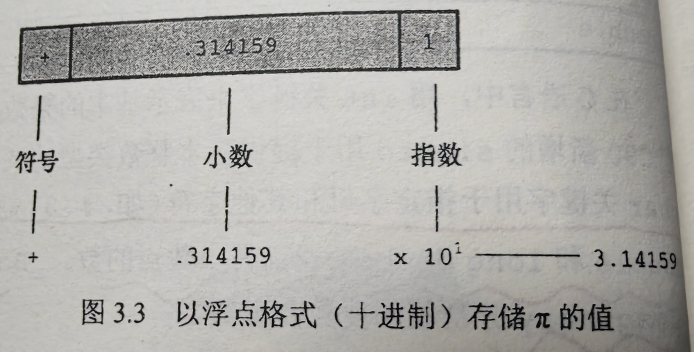

## 变量与常量数据
- 变量（variable）：会被改变的数据
- 常量（constant）：运行过程中不会改变的数据
## 数据类型关键字（粗略的介绍一些东西）

### 存储单元

- 位（bit）：是最小的存储单元，可以储存0或1，在计算机中的数量庞大，是计算机内存的基本构建块。

- 字节（byte）：1字节为8位，有256（2的8次方）种1或0的可能。

- 字：（word）：设计计算机时给定的自然存储单位。最早期1字长只有8位，后来出现了16位、32位，直到目前的64位。字长越大，数据转移越快，允许的内存访问更多。

### 整数和浮点数的表示
#### 浮点数：
可以理解为有小数点的数。浮点数有3种表示方法，如下表：（省略和后缀在后文‘浮点数常量’）

#### 二者的区别：
	- 存储方式不同，如5和5.00（后面的章节会讲）。
	- 在运算中，如：两个很大的数相减，浮点数损失的精度更多。
	- 浮点数通常是实际值的近似值。
## 基本数据类型
### 整数类型
#### int 类型
int类型属于有符号类型，ISO C规定的取值范围最小为-32768~32767。
- 声明int变量
	可以在几条声明中声明各变量，也可以在一条声明中声明几个变量，效果相同，都是为几个int大小的变量赋予名称并分配内存空间。如：int hogs（猪），cows，goats（山羊）；相当于int hugs；int cows；int goats；
- 初始化变量
	 就是为变量赋一个初始值。在C语言中，初始化可以在声明中完成，如：int hogs = 21；（21属于整型常量或整型字面量）
	注意：建议不要把初始化的变量和未初始化的变量放在同一条声明中，如：int dogs，cats = 44；//有效但不建议

##### 补充：
范围是  2的31次方-1（int是4字节，一字节八位）；联想两个灯泡（是3）

#### 其他整数类型
-  short 类型（或short int），比int小，16位。
- long类型（或~ int），32位。long long类型（C99加入），64位。Int类型，16位或32位，上述均为有符号类型。可在其前加signed（C90标准添加）强调有符号。
- unsigned int类型（或unsigned），非负值，可以表示更大的数。long类型（同上）short（）（C90加入）。long long型（99）。（位越大，占用空间大，运算速度越慢）             
	注：long类型后可加L或l，long long类型为LL或ll，有u的为ull、LLU、Ull。020L，ox10L，3LL。
#### 整数溢出
到达最大值时从起点开始算

### char 类型
用于存储字符，从技术层面，char是整数类型，8位。（一般是7位，还有128个用于各国自行填充）

#### 声明
- 字符常量和初始化
	- 字符常量：用单引号括起来的单个字符
	- 初始化：char dogs = 66，可以这样写但不好最好用‘B’代替66（好处：66存在于int32位，‘B’存在于char8位，占的更少。

转换过程：字符转二进制，存2进制。
Unicode：拥有所有字符。

#### 无符号类型
- 范围是：0-255
保证处理字符时不可能为负数

处理与网络协议相关的东西

#### 非打印字符
单引号只适用于字符、数字和标点符号，但是你会发现有的ASCII字符打不出来。这时候有三种方法可以解决。

- 使用ASCII码。例如，蜂鸣字符的码是7 ，于是可以这样写：char beep = 7;
- 使用转义序列。

	注：
	 - 八进制的表示，beep = ‘\007’（07也可以）
	 - 八进制和十六进制都是char类型，不得超过127，所以八进制三位，十六进制两位，但是都表示一个字符

注：
- x可以是大写
- N.A.是不适用的意思
- `\r` 回车不是换行的意思，是把光标移到最前面。（跟早期的打字机有关）
- 清除屏幕
`printf("\033[2J");`

#### 打印字符

[[格式化输出或输入#一些转换说明（printf函数）|汇总]]
占位符：（以R进制输出，可以读取其他进制）
%d  十进制               
%f float double 十进制
%o八进制    
%e 科学计数法浮点数
%x十六进制      
%a十六进制浮点数
%c char型
%s 字符串
%a 十六进制格式化输出
若要表示出前缀则需%#o、%#x、%#X                ^22ba47

%Lf %Le %La： long double
%u unsigned （int）
%lu： u long
%llu
%ld long

%hd short十进制
%ho short八进制

二进制前缀：0b
### _ Bool类型
实际上也是一种整数类型，占用一位存储空间
很实用！！！
false：0
true：1
- 需要引用<stdbool.h>头文件，可以直接用false和true
类型为bool
`bool is_right = false;`

### - 可移植类型: stdint.h和inttypes.h

#### C语言中定义在stdint.h头文件中的新的类型名

书上的有点错误，看链接[定宽整数类型 (C99 起) (lerogo.com)](https://cpp.lerogo.com/zh/c/types/integer.html))

- 精确宽度整数类型
	int32_t表示32位的有符号整数类型。若使用32位int的系统，头文件会把int32_t作为int的别名。若是在16位系统中，会将int32_t作为long的别名。
- 最小宽度类型（C99，C11）
	int_least_8_t是可容纳8位有符号整数值的类型中宽度最小的别名，如果系统最小的整数类型是16位，可能int_least_8_t不会被定义即没用会失效。有些能够使用的可能实现为16位的效果。
- 最快最小宽度类型（同上）
	例：int_fast8_t被定义为系统中对8位有符号值而言最快的整数类型

- 最大整数类型（C99）
	例：intmax_t可存储任何有效有符号整数值。uintmax_t最大无符号整数。可能比u long还大

[[一些注意事项#类型转换（Type Conversation）|一些注意事项]]

#### 相应的输入和输出需要用到inttypes.h

 注：inttypes.h头文件中定义了PRId32字符串宏（后面会学），代表32位有符号值的合适转换说明。
 [[一些注意事项#固定整数类型转换|<inttypes.h>的具体使用]]
### 浮点数类型（float，double，long double）
#### 浮点型常量及浮点数的表示
- 省略
	 不可同时省略小数点和指数部分，2.0e+5可以写成2e5或2.e5，0.45e4可以写成.45e4
	 不可以在浮点型常量中加空格，如：9.0 e5
- 后缀
	 9.11E9f是float，也可以是F。L或l是long double。一般无后缀的是double。
- float 六位有效数字，double 13位，
- 十六进制表达法（C99，不是所有的编译器都支持）
	 前缀0x或0X，p或P代替e或E表示2的幂,如0xa.lfp10表示的值为（10+1/16+15/256）* 1024
	 

[[单精度浮点数计算]]

#### float类型二进制（24位）换十进制

有效位的来源

24  / （$log_2 10$）$\approx$ 7.2（保守估计为6，7可能会不安全）
       3.321
- double(52+1)
53 / ($log_2 10$) $\approx$ 15.95（保守估计为15，同上）

#### <float.h>的使用
其中有一些特殊的值。
例如：
- FLT_DIG：等于6，即float小数点后的有效位 

#### IEEE 754 隐含（前导1）

二进制总是从1开始，（那23位如果是以0开始前面的0就没有意义，所以有个前导1，有个规范化前导1）
### 复数和虚数类型

- 有三种复数类型：float_Complex、double_Complex、long double_Complex.
	例float_Complex类型的变量应包含两个float类型的值。

- 有三种实数类型：float_Imaginary、~~、~~。

若使用complex.h头文件，便可用complex代替_Complex、imaginary代替~,I代替-1的平方根。
## 其他
#### sizeof()

一般使用%zd转换说明sizeof（）的返回类型(c99),若不支持，则用%u或%lu

注：
	- C语言中没有字符串，用的是字符数组来模拟字符串
	- sizeof 计算的是字符串在内存中的长度即数组长度，返回的是变量声明后所占的内存数，而不是实际长度

### 关于溢出的计算
- char 类型
char num = 126，若num+45= 172 - 256 = -85
unsigned char num = 2，若num - 100 = - 98 + 256 = 158
