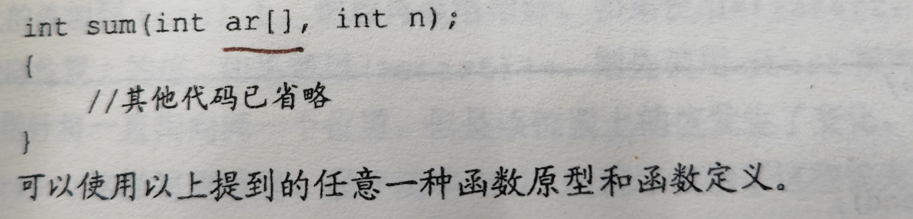

## 数组

多个数据和变量处理（思考方向）：
- 数据组织
- 资源管理
- 性能优化
### 初始化数组

`定义，初始化数组时，长度都不可以为变量，因为C语言要求在编译时，长度就为常量，运行时箱子已经分好了。`
~~~
int powers[8] = {1,2,4,6,8,16};/*从ANSI C开始支持这种初始化*/
~~~
（若不支持ANSI C，在数组声明前加上关键字static。
- 使用const声明数组。
- 即，把数组设置为只读，这样程序只能从数组中检索值，不把新值写入数组，使用数组前必须初始化数组。
- 存储类别警告
数组也可以被创建成不同的存储类别，上述的数组属于自动存储类别。即，这些数组在函数内部声明，且声明时未使用关键字static。
- 初始化部分数组，剩下的元素会被初始化为0.
- 可以省略方括号中的数字，让编译器自动匹配

### 指定初始化器（C99）
C99新增特性：指定初始化器。可以初始化指定的数组元素。
~~~
int arr[6] = {[5] = 212}; //把arr[5]初始化为212
~~~
假如是如下的代码：
~~~
int days[12]o = {31, 28, [4] = 31, 30, [1] = 29};
~~~
在4后面的数被初始化的时候，下标往后推，即，5.

### 给数组元素赋值
循环赋值

### 数组边界
- 确保下标是有效的值。
- 越界下标是未定义的值。
- 可以使用符号常量来表示数组的大小

## 多维数组

在计算机内部，数组按顺序存储，从第一个内含12个元素的数组开始，依次类推。

- 可以把一维数组想象成一行数组，把二维数组想象成数据表，把三维数组想象成一叠数据表。

## 注意事项
总是初始化数组，有些编译器不会自动补零。
## 指针

地址：内存地址

### 声明指针
~~~
int * pi;    //pi是指向int类型变量的指针
char * pc;   //pc是指向char类型变量的指针
~~~

通常程序员在声明时使用空格，在解引用变量省略空格。

### 使用指针在函数间通信

指针有一种开了vip的感觉，可以在各个函数中穿梭。改变指向对象的值，主调函数中的也会变。

## 指针和数组
- 数组名时指针的首地址
- 在C中指针加1，指的是增加一个存储单元，对数组来说是下一个元素的地址，而不是下一个字节的地址。
- 即，指针加一，指针的值递增它所指向类型的大小（地址的值）
- 指针需要知道对象的类型的原因就是因为它需要知道存储对象需要多少字节。

### 野指针
- 乱指，指向了一个无效的内存地址，或者是已经释放的内存地址。（释放是指已经被删了，没有了）会污染程序。
### 空指针
- NULL，没有指向任何有效内存的指针，（创建快捷方式还没有点确定）

### 悬挂指针（Dangling pointer）
- 一个指针指向一个内存被释放（回收），指针依然保持之前的地址不变。

后面如果再访问十分危险；
- 如何处理？
将ptr设置为NULL，避免悬挂指针。

所以说free一般再return前free。
### 指针间的距离
即用指针减去指针。（属于ptrdiff_t类型，格式化符是%td，一般在64位系统上要用64大小的符）
计算数组大小：
`int size = sizeof(numbers)/sizeof(numbers[0]);`
sizeof(numbers)：计算数组大小，单位是字节
sizeof(numbers[0])：计算第一个元素大小，单位：字节（4字节）。
## 函数，数组和指针
~~~
ar[i]与 *(ar + i)相同
~~~

### 函数指针（Function pointer）
指向函数的指针

- 函数指针的用途
实现回调函数，
回调函数：允许你将一个函数作为一个参数传递给另一个函数，这样，当特定的事件发生的时候，可以用传递的参数。（事件驱动编程）

（可以使用函数数组，灰常厉害）

可以用typedef 使自己写的一个函数变成一个类型，否则，就相当于写了一个变量，只能用一次。

 

## 使用指针形参
观察下列两种不同的结束加法循环的方法

sum（）是用n个参数表示
sump使用指针表示，会更为简洁
answer = sump(mables, marbles + SIZE);

## 指针操作
- 赋值：数组名，带地址运算符的变量名，另一个指针。
- 解引用
- 取址：指针和整数相加都是以存储单元为单位增加。
- 指针求差：求出的数是两元素之间的距离，例如，ptr2 - ptr1 = 2，是指两个元素之间相隔两个int而不是2字节，（int4字节本电脑）
注：不可解引用未初始化的指针。
~~~
int * pt; //未初始化的指针
*pt = 5；//解引用，严重的错误
~~~

## 保护数组中的数据

程序需要在函数中改变值时才需要用到函数。如果是数组必须传递指针，这样效率才高。
C一般传递数据而不是地址，这样做可以保证数据的完整性。

如果函数的意图不是改变数组中的内容，可以使用const关键字。即，在声明数组形参时使用const
int sum(const int ar [], int n);
### const 的一些内容
- 使用const创建变量，比#define更灵活，对指针，数组等都适用。
const double PI = 3.14159；
- 指向的指针不能用来改变值
- C语言中的const也不可以作数组长度，它在编译（build）时还是变量，只是后期把数固定了。
~~~
int rates[3] = {0, 1, 2};
const int * pd = rates;
~~~
可以通过rates改变值，但是不能通过pd改变它所指向的值。
- const数据可以给const指针，也可以给无const指针，无const数据地址只能给普通指针
- 创建地址时可以使用两次const，
~~~
const double * const pc = rates;
~~~

## 指针和多维数组
~~~
int zippo[4][2];
~~~
zippo是一个内含两个int值的数组
- zippo是数组首元素的地址，zippo[0]是一个占用一个int大小对象的地址，而zippo是一个占用两个int大小对象的地址。因为这个整数和内含两个整数的数组都开始于同一个地址，所以zippo和zippo[0]的值相同。
- 给指针或地址加一，其值会增加对应类型大小的数值。zippo+1合肥zippo[0]+1的值不同，zippo两个int，zippo[0]一个。
- 对zippo解引用两次才能获得上面的值，zippo[0]也是一个地址。
- * (* (zippo+2) + 1)等价于数组表示法。
### 指向多维数组的指针
指向数组的指针
~~~
int matrix [3][2] = {
{1,2}
{2,3}
};
int (* pz)[2] = matrix;  //pz指向一个内含两个int类型值的数组的指针（指向长度为2的一维数组,即二维数组首地址，上面的第一行）
~~~
因为[]的优先级高于*，所以要使用圆括号

例如：二维数组，
二维数组的首地址是第一行的所有内容。

- 指针数组（数组中存的都是地址）
下面相当于声明了三个指针。
~~~
int * pax[2];  //pax是一个内含两个指针元素的数组，每个元素都指向int的指针（两个地址）
~~~
指针也可以使用pz[ 2 ]  [ 1 ] 的写法

### 指针的兼容性
- 指针之间的赋值比数值类型之间的赋值严格

## 指针的作用域和生命周期

- 局部指针（比如说在函数中）

只能在函数中被访问，函数执行后指针会消失，但是指针指向的区域（相对应的地址）没有消失，很有可能用于其他目的。可能函数外有其他函数，指针等等去使用这个地址，这是非常危险的。