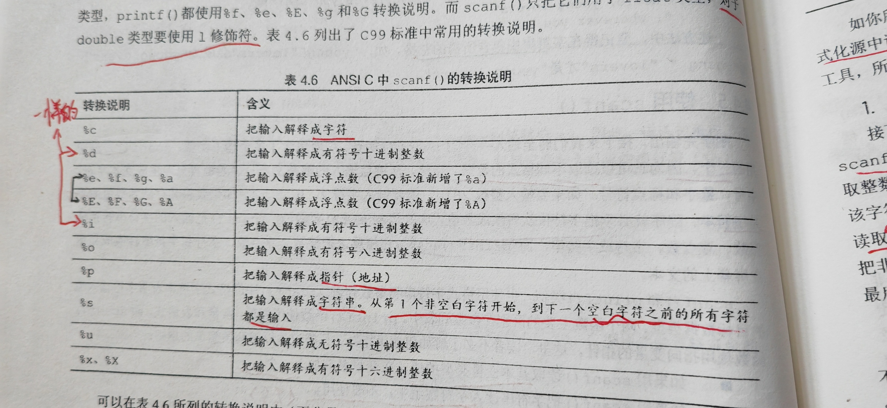
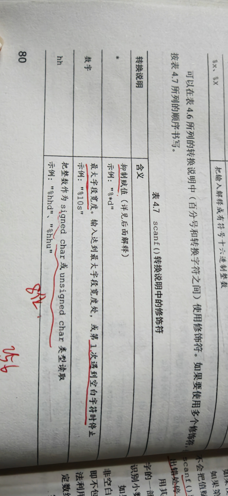
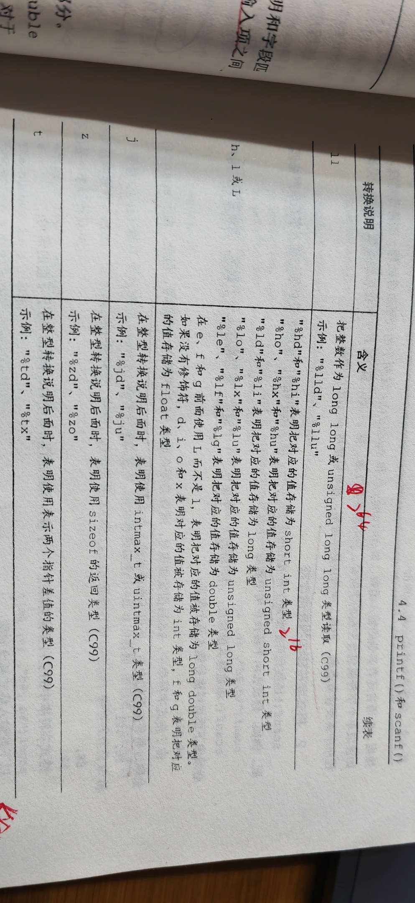
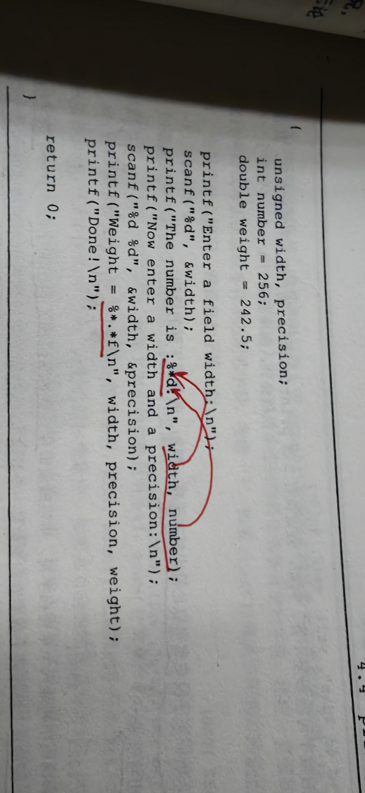
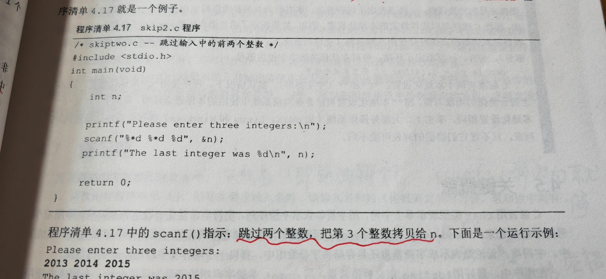

## 字符串的介绍
一个或多个字符的序列。注意双引号并不是字符串的一部分，双引号仅告知编译器它括起来的是字符串。
### char 类型数组和null字符
~~~
- c语言没有专门用于存储字符串的变量，字符串都被存储在char类型的数组中。数组末尾位置会有非打印字符 \0（即空字符，会隐藏起来，不显示）也需要占一个字节的位置。如：char name[40]只能存39个字符。（包括空格等）
- 数组可以看作是连续的多个存储单元，40是指该数组中的元素数量。
- 字符串的转换说明是%s，scanf("%s", name，40);该语句会在第一个空白处停止。Vs2022要在后面加上数组的大小    注：字符和字符串的区别“x”=‘x’+\0
-\0就是null字符
~~~

### strlen()函数
~~~
注:sizeof的运算对象是类型时，后面一定要有括号，如sizeof(int)或sizeof(char)。对于特定量,括号可有可无，可以写成sizeof name或sizeof 6.28，但是最好加上括号
~~~
## 常量和C预处理器
符号常量约等于明示常量，C预处理器指的是以“#”为行首的指示。#define,指的是宏定义
const也可以用来定义。
### 明示常量                                                       
c头文件limits.h和float.h分别提供了整数类型和浮点数类型大小限制相关的详细信息，如：limits.h包含了#define INT_MAX +32767 ， # define INT_MIN -32768(表示int类型可表示的最大值和最小值，如果系统使用32位的int，该头文件会为这些明示常量提供不同的值)

## printf()和scanf()
### printf()函数

#### 一些转换说明（printf函数）

打印注意点：打印数据使用 %d 等，若要打印“%”应该使用两个“%”

#### 转换说明修饰符（在%和转换字符中插入）
注：
- 类型可移植性（sizeof）
	sizeof运算符以字节为单位返回类型或值的大小。（某种形式的整数，一定是无符号整数）不同的值要用不同的转换说明。不同的系统转换说明的要求不同，将程序移植到不同的系统要进行修改。所以，C提供了可移植性更好的类型。stddef.h头文件（stdio.h头文件中有）把size_t定义成系统使用sizeof返回的类型，这被称为底层类型。并且printf()用z修饰符来表示相应的类型。类似的还有ptrdiff_t类型和t修饰符。

 - float参数的转换
	在K&R C中，float类型值会自动转换为double。一般而言，ANSI C不会自动转换。但是，有大量的程序都假设float类型的参数被自动转换成double，为了保护这些程序，printf（）中所有float类型的参数仍然自动转换成double。所以K&R C和ANSI C中都没有float的转换说明。
#### 一些标记

注：小数点前是宽度限制，若实际宽度大于限制宽度，以实际宽度为准。

小数点后是精度限制，字符串中例：.5告诉printf（）只打印5个字符，若是数值则是几位小数。
#### 转换说明的意义
转换说明把以二进制格式存储在计算机中的转换成一系列字符（字符串）以便于显示。例：76在计算机内部的存储格式是二进制数01001100。%d将其转换为7和6，并显示为76。转换说明约等于是翻译说明。
##### 转换不匹配

解释：
第二行unsigned short表示的正数，而-336是负数，这种情况系统使用二进制补码来表示有符号整数，即0-32767表示数本身，32768-65535表示负数。其中65535表示-1，32768表示-32767，而-336则表示为（65536-336=）65200。

第三行char是一字节，而336大于255，当printf()使用%c打印336时只会读取后8位。336的二进制是0000000101010000，只会读取紫色部分，所得的数为80，80在ASCII表中对应的码为P。
##### printf()的返回值
printf()函数也有一个返回值，他返回打印字符的个数(包括了空格和不可见的换行符`\n`)
### scanf()函数

作用：可以读取不同格式的数据（键盘输入的都是文本，只能生成文本字符）
printf（）函数使用变量，常量和表达式，scanf（）函数使用指向变量的指针

#### 使用scanf（）
##### 两条简单的规则
- 使用scanf（）读取基本变量类型的值，在变量名前加上一个&；
- 把字符串读入字符数组中，不使用&；
有多个输入时，两个输入之间有至少一个换行，空格或制表，都可以，除了%c
##### 转换说明

注：double类型一定要加l，例如%ld。
scanf（）转换说明的作用是识别相应类型
- %s解释：scanf（）读取第一个非空白字符并保存非空白字符直到再遇到空白。
~~~
scanf（）在把字符串放进字符数组中时，它会在字符串末尾自动加入一个“\0"。
~~~
##### 修饰符

##### 输入时的注意事项
- 除空格字符外的普通字符必须与输入字符串严格匹配
- 除了%c，其他转换说明自动跳过输入值前面的所有空白。
- %c：除非scanf（）中的%c前有空格则从第一个非空白字符开始读取。
##### scanf（）的返回值

scanf（）返回成功读取的项数。
当scanf（）检测到”文件结尾“时，会返回EOF（是stdio.h中定义的特殊值，通常用#define指令把EOF定义为-1）

如果scanf（）在转换值之前出了问题（例如，检测到文件结尾或遇到硬件问题），会返回一个特殊值EOF（其值通常被定义为-1），这个值也会引起循环终止。

EOF在C语言中表示end of file，意思是，没有任何数据可以从输入流中读取，也就是输入流结束了，专门用来指示文件读取或输入操作已经到达了数据源的末尾。
### printf（）和scanf（）的* 修饰符
##### printf（）
如果你不想预先指定字符宽度或精度，想通过程序实现，则可以使用* 修饰符

##### scanf（）
把* 放在%和转换字符中间时，会使得scanf（）跳过相应的输入项。

