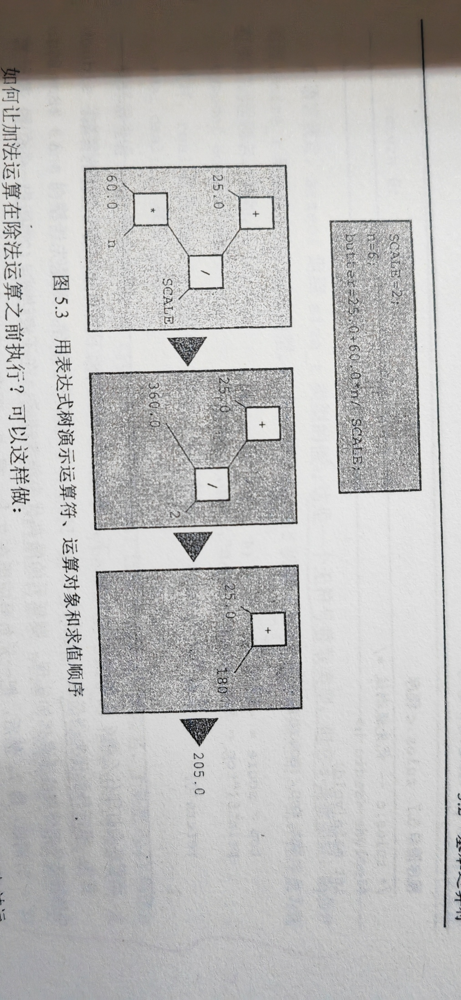

## 四种运算符大类
=，+，-，* ，/（C语言无指数运算，可用函数pow（）代替
### 算数运算符
#### 除法运算符”/“
- 整数除法会发生截断现象（不会四舍五入）
- 避免使用混合类型（VS2022是趋零截断（C99规定））

#### 求模运算符”%“
只用于整数运算，不能用于浮点数，得出的数为余数。
C99规定了”趋零截断“，如果是C99之后，第一个运算对象是负数求模结果也为负数，为正数，求模结果也是正数。
如果不支持C99，可以用”/“，用被除数减除数乘商。

#### 递减运算符”--“
大体同递增运算符
注意点：
- 如果一个变量出现在一个函数的多个参数中，不要对该变量使用
- 如果一个变量多次出现在一个表达式中，不要使用
### 关系运算符

### 逻辑运算符：“&&，||，！”
与 或 非
C保证逻辑表达式的求值顺序从左到右。
&&和||都是序列点，在下一个运算对象之前所有的副作用都会生效。
C保证一旦发现某个元素让整个表达式无效，便立即停止求值。
一般用于测试范围。

### 赋值运算符
#### ”=“
=左边必须是一个变量名（即赋值运算符左侧必须引用一个存储位置），C使用”可修改的左值“标记可赋值的实体。
解释：（赋值语句的目的是把值存储到内存位置上）
- 数据对象：用于存储值的数据存储区域
- 左值：标识特定特定数据对象的名称或表达式。
- 右值：能赋值给可修改的左值的量。
注：使用变量名是表示对象的一种方法，除此之外还会使用到其他的方法
对象指的是实际的数据存储左值是用于标识或定位存储位置的标签。
学习过程中，被称为”项“的就是运算对象，（运算符操作的对象）。

#### 复合赋值运算符
原地修改（In-place Modification），性能更好
在原来的存储位置修改。

### 符号运算符
”+“，”-“
一元运算符，
[[初识C语言#语言标准|C90]]新增：”+“


## 运算符优先级
表达式树


## 其他运算符
### sizeof（）运算符和size_t类型
- sizeof运算符以字节为单位返回运算对象的大小（一字节定义为char类型占用的空间大小）。运算对象可以是具体的数据对象（如，变量名）或类型。如果运算对象是类型，必须用圆括号将其括起来。
- sizeof返回size_t类型的值，这是一个无符号整数类型。
注：size_t不是一个新类型，在C头文件系统中用typedef把size_t作为unsigned int或unsigned long的别名，C99规定可以将%zd用于size_t类型printf（）显示。如果不支持就用%u，%lu。


### 强制类型转换运算符
将数据类型用括号括起来。
float num =（int）10.3+3；
num = 13；


### 可以用fabs（）函数（math.h)表达浮点数的绝对值
在fabs函数中输入浮点数，可以返回一个浮点数的绝对值。

### 逗号运算符（少用）
两个性质：
- 保证了被它分隔的表达式从左往右求值（换言之，逗号是一个序列点，所以逗号左侧项的所有副作用都在程序执行逗号右侧项之前发生）
- 整个逗号的表达式的值右侧项的值


### 条件运算符：“？ ：”
三目运算符
真为前面那个，假为后面那个

### 查找地址：&运算符（取地址符）
- 指针，用来存储变量的地址。scanf（）函数中就用地址作为参数。如果主调函数不使用return返回的值，则必须通过地址才能修改主调函数中的值。（pc地址常用十六进制来表示）

### 间接运算符：*
- 也称解引用运算符（Deference Operate）

### 按位移位运算符：<<或>>
用来处理二进制数据。

例如：
```
uint_8 num = 22;
//00010110
num << 2;
//01011000,相当于乘以2的2次方
```

无符号：左移低位补零，右移高位补零

不用无符号，位移操作容易导致数据溢出，即符号位改变（左移）

位移可以替代加减乘除来优化性能。

### 按位运算符

#### 按位与&
比较两个数，都为1时为1，其他情况均为0，如果只有一位不算，丢掉
 例如：   1   1   0   0
    1     1   0   0   1
=            1   0   0   0

- 可以控制某个位置上的数，将其清0
- 检查某个位置上的数是否为1或0

- 掩码
让要处理的数变成所需要的数的二进制数。
#### 按位或：|
都为0时为0，其他情况为1

- 将某个位置上的数变成1
- 检查是否为0或1

#### 按位异或：^
同假异真

ALU中（XOR）
- 翻转特定位，不同就翻
- 交换两个数（不好用）
```
a = a ^ b;
b = a ^ b;
a = a ^ b;
```
- 检测不同

#### 按位取反~
相反