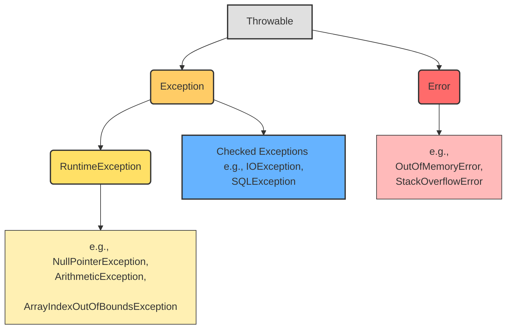

- 定位错误类型：知道错误是从哪来的
Throwable下面有两个类：Error和Exception



## Part 1 异常（exception）和错误（Error）

### Error (错误)
-   **定义**: `Error` 类及其子类通常表示 Java 虚拟机 (JVM) 运行时遇到的严重问题，这些问题通常是不可恢复的，并且应用程序本身通常无法处理。
-   **特点**:
    -   通常由 JVM 内部错误或资源耗尽引起（如 `OutOfMemoryError`, `StackOverflowError`）。
    -   应用程序通常不应尝试捕获 `Error`。
    -   很难通过修改应用程序代码来解决，可能需要调整 JVM 配置或解决环境问题。
### Exception (异常)
-   **定义**: `Exception` 类及其子类表示程序运行时可能发生的可恢复问题或非致命错误。这些通常是由程序逻辑错误、无效输入或外部条件（如文件未找到）引起的。


- 可以去API里查错误


### 编译时 vs 运行时错误
-   **编译时错误 (Compile-time Error)**: 在代码编译阶段发现的错误，通常是语法错误或类型不匹配。如果存在编译错误，`.class` 文件不会生成。在out文件夹里点开对应的类，如果有class文件，就不是编译错误

-   **运行时错误 (Runtime Error/Exception)**: 在程序执行期间发生的错误或异常。即使代码成功编译（生成了 `.class` 文件），运行时仍可能出错。`Error` 和 `RuntimeException` 通常在运行时抛出。

- 我们可以看除以0时的异常的父类


## Part 2: 异常处理机制
### try...catch
#### 介绍
-   **目的**: 用于捕获并处理可能抛出异常的代码块。
-   **结构**:
    -   `try`: 包裹可能会抛出异常的代码。
    -   `catch`: 定义异常处理逻辑。当 `try` 块中的代码抛出与 `catch` 块声明的异常类型匹配（或是其子类）的异常时，该 `catch` 块会被执行。
 
- try：包裹可能出现异常的代码
- catch：捕获异常并处理异常的代码块
- finally：包裹无论是否发生异常都要执行的代码块
- throw：手动抛出异常
- throws：

- 快捷键：`Ctrl+Alt +t`


```java
import org.junit.Test;

public class ExceptionHandlingTest {

    @Test
    public void demoTryCatch() {
        int a[] = new int[2];
        try {
            // 尝试访问数组边界之外的元素，会抛出 ArrayIndexOutOfBoundsException
            System.out.println("尝试访问索引 3 的元素: " + a[3]);
            // 如果上一行抛出异常，这一行不会被执行
            System.out.println("这行代码在 try 块中，异常之后。");
        } catch (ArrayIndexOutOfBoundsException e) { // 精确捕获特定异常
            System.err.println("捕获到数组越界异常!");
            // 打印异常的堆栈跟踪信息，有助于调试
            e.printStackTrace();
        } catch (Exception e) { // 可以捕获其他类型的异常（作为备用）
            System.err.println("捕获到其他类型的异常!");
            e.printStackTrace();
        }
        System.out.println("try-catch 块执行完毕。");
    }
}
```

> [!WARNING] 关于 `e.printStackTrace()`
> `e.printStackTrace()` 会将详细的错误信息（包括异常类型、消息和代码执行路径）打印到标准错误流。在开发和调试阶段非常有用。但在生产环境中，通常建议使用日志框架（如 Log4j, SLF4j）记录异常，而不是直接打印堆栈跟踪，并且 **不应** 将 `catch` 块留空或仅包含注释，这会隐藏错误。

#### 多重捕获
-   **匹配顺序**: JVM 会从上到下依次检查 `catch` 块，执行第一个与抛出的异常类型匹配的块。
-   **顺序要求**: 如果捕获的异常类型之间有继承关系，**子类异常必须放在父类异常之前**，否则编译器会报错（因为父类会捕获所有子类异常，导致后面的子类 `catch` 块永远无法到达）。

```java
try {
    // 可能抛出多种异常的代码
} catch (ArrayIndexOutOfBoundsException e) {
    // 处理数组越界
} catch (NullPointerException e) {
    // 处理空指针
} catch (Exception e) { // 捕获所有其他 Exception 类型的异常（应放在最后）
    // 通用处理
}
```

### finally
-   **目的**: 定义一段无论是否发生异常都 **必须** 执行的代码。
-   **常见用途**: 资源释放（如关闭文件流、数据库连接、网络连接等）。

```java
import org.junit.Test;

public class FinallyTest {

    @Test
    public void demoFinally() {
        int a[] = new int[2];
        try {
            System.out.println("尝试访问索引 3 的元素: " + a[3]); // 抛出异常
            System.out.println("try 块中的代码（异常之后）"); // 不会执行
        } catch (ArrayIndexOutOfBoundsException e) {
            System.err.println("捕获到异常!");
            e.printStackTrace();
            // 即使 catch 中有 return，finally 也会执行
        } finally {
            // 无论是否发生异常，这里都会执行
            System.out.println("Finally 块：异常处理流程结束或 try 正常完成。");
        }
        System.out.println("方法继续执行..."); // 如果异常被捕获，这里会执行
    }
}
```

```java
@Test  
public void demo(){  
    int a[] = new int[2];  
    try {  
        System.out.println("Access element three :" + a[3]);  
        System.out.println("Out of the block");  
    } catch (Exception e) {  
        e.printStackTrace();  
    }finally{  
        System.out.println("异常捕获完成！");  
    }
```

### throws/throw

> [!SUMMARY] `throw` vs `throws`
> -   `throw`: 用在方法体内部，表示 **抛出** 一个具体的异常对象。
> -   `throws`: 用在方法签名上，表示 **声明** 该方法 **可能** 抛出的受检异常类型。

#### throw
-   **目的**: 在代码中 **手动抛出** 一个异常对象。
-   **用法**: `throw new ExceptionType("错误信息");`

```java
public void processFile(String filePath) throws FileNotFoundException {
    File file = new File(filePath);
    if (!file.exists()) {
        // 文件不存在，手动抛出 FileNotFoundException (这是一个 Checked Exception)
        throw new FileNotFoundException("文件未找到: " + filePath);
    }
    // ... 文件存在，继续处理 ...
    System.out.println("文件处理中...");
}
```

#### throws
-   **目的**: 在方法签名中 **声明** 该方法可能会抛出的 **受检异常 (Checked Exceptions)**。
- throws：如果想要用上面的方式，就必须在方法名后加上throws

```java
import java.io.FileNotFoundException;
import java.io.IOException;

public class ThrowsExample {

    // 方法声明了可能抛出 FileNotFoundException
    public void readFile(String path) throws FileNotFoundException {
        System.out.println("尝试读取文件: " + path);
        // 假设这里有一些可能抛出 FileNotFoundException 的操作
        if (path == null || path.isEmpty()) {
            throw new FileNotFoundException("文件路径不能为空");
        }
        // ... 实际的文件读取逻辑 ...
    }

    // 调用者必须处理 readFile 声明的 FileNotFoundException
    public void process() {
        try {
            readFile("myFile.txt");
        } catch (FileNotFoundException e) {
            System.err.println("处理文件未找到异常: " + e.getMessage());
            // 进行错误处理或记录日志
        }
    }

    // 或者，调用者也可以继续声明 throws
    public void processAndThrow() throws FileNotFoundException {
        readFile("anotherFile.txt");
    }
}
```

throws和throw new搭配使用
## Part 3: 空指针异常 (`NullPointerException`)
-   **类型**: `java.lang.NullPointerException`
-   **继承关系**: `Exception` -> `RuntimeException` -> `NullPointerException` (非受检异常)
-   **预防**:
    -   在使用对象引用之前，检查它是否为 `null`。
    -   使用 `Objects.requireNonNull(obj, "message")` 在方法入口处进行参数校验。
    -   利用 Java 8+ 的 `Optional` 类来更好地处理可能为 `null` 的值。
    -   初始化对象变量。

- NullPointerException


- 如果抛出了异常，多半是以下问题


> [!INFO] `java.util.Objects` 类
> `Objects` 类（注意是复数）是 `java.util` 包下的一个工具类，提供了很多静态方法来操作对象或检查对象状态，例如 `isNull()`, `nonNull()`, `requireNonNull()` 等，可以方便地进行空值检查。不要与 `java.lang.Object` 类（所有类的根类）混淆。

lang包：大多是工具
## Part 4 自定义异常（简易版）
-   **步骤**:
    1.  创建一个新的类，继承自 `Exception` (创建受检异常) 或 `RuntimeException` (创建非受检异常)。
    2.  通常提供至少一个构造方法，接收一个 `String` 参数作为错误消息，并调用父类的 `super(message)` 构造方法。
    3.  可以根据需要添加其他构造方法（如无参构造、接收 `Throwable cause` 的构造等）。

### 案例一：简单自定义异常

```java
//定义自定义异常类（继承Exception，为受检异常）
-异常类（使用constructor快速生成方法）
-ExhaleException.java
public class ExhaleException extends Exception{  
	//提供不同参数的构造方法，调用父类构造
    public ExhaleException() {  
	    super();
    }  
    public ExhaleException(String message) { 
        super(message);  
    }  
    public ExhaleException(String message, Throwable cause) {  
        super(message, cause);  
    }  
    public ExhaleException(Throwable cause) {  
        super(cause);  
    }  
    public ExhaleException(String message, Throwable cause, boolean enableSuppression, boolean writableStackTrace) {  
        super(message, cause, enableSuppression, writableStackTrace);  
    }  
}
-测试方法
@Test  
public void demo() throws ExhaleException {  
    int age = 19;  
    if (age > 18) {  
        throw new ExhaleException("年龄大了！");  
    }  
}
```
-结果


### 案例二
```java
-异常类同上
-要测试的方法
public int sum(int a, int b) throws ExhaleException {  
    if (a > 10 || b > 10 || a < 0 || b < 0) {  
        throw new ExhaleException("只能求0-10的加法！");  
    }  
    return a + b;  
}  //这个不能加@Test，这个是正式的函数
  
@Test  
public void test(){  
    try{  
        int number = sum(100, 200);  
    }catch (ExhaleException e){  
    //捕获处理自定义异常
        e.printStackTrace();  //打印堆栈信息
    }  
}
```

-结果


## Part 5 辨析RuntimeException和Exception
|**特性**|**受检异常（Checked Exception）**|**非受检异常（Unchecked Exception）**|
|---|---|---|
|**检查时机**|编译时|运行时|
|**是否必须处理**|是|否|
|**继承关系**|继承自`Exception`，但不是`RuntimeException`|继承自`RuntimeException`|
|**例子**|`IOException`, `SQLException`|`NullPointerException`, `ArithmeticException`|
- 如果定义的是RuntimeException，那么只有在运行的时候才会报错，编译的时候是不会报错的


- 如果定义的是Exception，那么在编译的时候就会报错

 *(如果 `ExhaleException` 继承 `RuntimeException`，`test` 方法调用 `sum` 时不需要 `try-catch` 或 `throws`，编译会通过，但运行时若条件满足仍会抛异常)*

> [!CHOICE] 如何选择？
> -   如果异常表示的是调用者可以通过检查避免的编程错误（如非法参数），倾向于继承 `RuntimeException`。
> -   如果异常表示的是程序外部的、不可预测但又可能恢复的问题（如资源不可用），倾向于继承 `Exception` (创建受检异常)，强制调用者关注和处理。

## Part 6 自定义异常高级版
- 在大型应用程序或需要标准化错误处理的场景中，通常会为不同的错误情况定义统一的错误码 (Error Code) 和错误信息 (Error Message)。这种方法便于错误管理、日志记录、问题追踪、国际化以及前后端系统间的通信。

- **核心思想**：
	1. 创建一个`ErrorCode`接口，规定所有的错误码和实现类都必须提供获取错误码和错误信息的方法
	2. 使用枚举（`enum`）实现`ErrorCode`接口，将所有预定义的错误类型及其对应的code和message集中定义在一个地方
	3. 使自定义异常类的构造函数接收一个`ErrorCode`对象，并利用`ErrorCode`提供的信息来初始化异常。（尤其是错误信息）
```java
-接口：ErrorCode.java
/**
 * 错误码接口
 * 定义了获取错误码和错误信息的标准方法。
 */
public interface ErrorCode {  
    /**
     * 获取错误码。
     * 错误码通常是一个简短的、唯一的标识符（如 "404", "BIZ-1001"）。
     * @return 错误码字符串
     */
    String getCode();  
  
    /**
     * 获取错误信息。
     * 错误信息是对错误的描述，通常用于日志记录或展示给用户。
     * @return 错误信息字符串
     */
    String getMsg();  
}
-枚举：NameCodeEnum.java

/**
 * 错误码枚举实现
 * 实现了 ErrorCode 接口，集中定义了应用程序中的具体错误类型。
 */
public enum NameCodeEnum implements ErrorCode{      // 定义具体的错误枚举常量，每个常量包含 code 和 msg
    NOT_FOUND_PAGE("404","找不到网站资源"),  
    NOT_FOUND_FILE("888","找不到文件异常"),  
    NOT_O_TEN("233","只能求0-10以内的加法"),  
    ;  
    private final String code;  
    private final String msg;  
	// 枚举构造方法（默认为 private）
    NameCodeEnum(String code, String msg) {  
        this.code = code;  
        this.msg = msg;  
    }  
    // 实现接口方法
    @Override  
    public String getCode() {  
        return code;  
    }  
  
    @Override  
    public String getMsg() {  
        return msg;  
    }  
}

-异常类：ExhaleException.java
/**
 * 自定义异常类 (高级版)
 * 构造时接收一个 ErrorCode 对象，用于标准化错误信息。
 * 假设这里我们仍将其定义为受检异常 (继承 Exception)。
 */
public class ExhaleException extends Exception{  
   private final ErrorCode errorCode; // 可以保存传入的 ErrorCode 供后续使用

    /**
     * 构造方法，接收一个 ErrorCode 对象。
     * 使用 ErrorCode 的消息来初始化异常。
     * @param errorCode 包含错误码和错误信息的 ErrorCode 对象
     */
    public ExhaleException(ErrorCode errorCode) {  
        super(errorCode.getMsg());  
    }  
    /**
     * 构造方法，接收 ErrorCode 和原始异常 (cause)。
     * 用于异常链。
     * @param errorCode 包含错误码和错误信息的 ErrorCode 对象
     * @param cause 导致此异常的原始异常
     */
    public ExhaleException(ErrorCode errorCode, Throwable cause) {
        super(errorCode.getMsg(), cause);
        this.errorCode = errorCode;
    }
    /**
     * 获取与此异常关联的 ErrorCode 对象。
     * @return ErrorCode 对象
     */
    public ErrorCode getErrorCode() {
        return errorCode;
    }
}
-Test类：
public class MyTest {  
    /**
     * 示例业务方法：计算和，但对输入有限制。
     * @param a 加数 a
     * @param b 加数 b
     * @return a + b
     * @throws ExhaleException 如果输入不符合要求 (0-10)
     */
    public int sum(int a, int b) throws ExhaleException {  // 声明抛出受检异常
        if (a > 10 || b > 10 || a < 0 || b < 0) { 
        // 输入不合法，抛出带有特定错误码的自定义异常
            throw new ExhaleException(NameCodeEnum.NOT_O_TEN);  
        }  
        return a + b;  
    }  
    
    @Test  
    public void test(){  
        try{  
            int number = sum(100, 200);  
        }catch (ExhaleException e){  
            e.printStackTrace();  
        }  
    }  
}
```
-结果


### 优点

-   **标准化**: 统一了错误码和错误信息的定义方式。
-   **易维护**: 错误信息集中在枚举类中，方便修改和管理。
-   **清晰**: 异常对象携带了结构化的错误信息（code + msg），便于程序化处理。
-   **解耦**: 业务逻辑只关心抛出哪个 `ErrorCode`，具体的 code 和 msg 由枚举定义。