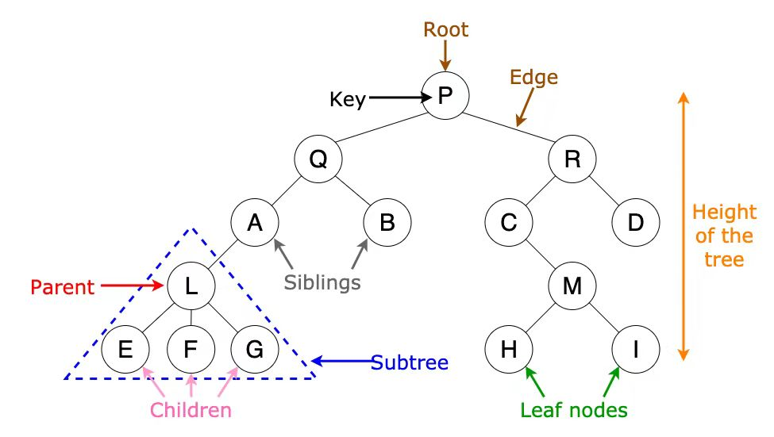

与家谱类比。



sibling：兄弟
A和B称为兄弟节点（sibling node），
root称为根节点（root），
EFG称为孩子节点（child node），
L称为父节点（parent node）。
三角形里的是子树。
节点的度为零的节点称为叶节点（Leaf nodes）,
目前有5代人，有两种说法，一种是深度，一种是高度。
- 高度（height）：从下往上（人长高是往上长）
- 深度（depth）：从上往下（其值等于节点的level(与根节点之间唯一路径上的边数)）
所以根节点的深度为零，叶节点的高度为零。

时间复杂度通常和节点有关，有的和边数有关。

- 节点的度（degree）：一个节点含有的子树的个数
- 树的度（degree of tree）：最大的节点度
- 
## 作用

"层级关系"
公司等级表，每一个员工都是上一级的子节点。

文件夹里套文件夹。（文件夹的层级系统）

  - 搜索引擎 
  - IDE 语法分析 表述语法树

linux扩展：
/ 根目录 root

## 常见树的种类

### 二叉树 （binary tree）

平均深度：$O(N^{1/2})$
普通二叉树的时间复杂度为O(N)，根据节点来计算的

拥有最多两个子节点的树称为二叉树，最多三个称为三叉树。


K叉树，最多有K个节点（k-ary tree）
k = 2时，二叉树

将一棵树转化为二叉树，则这棵二叉树是唯一的。
### Perfect Binary Tree 完美二叉树

叶节点都是同一个level，即同一个深度

### Complete Binary Tree 完全二叉树

近乎完美。almost perfect。
每个节点都有两个子节点，但是叶节点不一定是同一个level（深度）。
最后一代必须在最左边的分支上。
只有最后一层没有满。
完全二叉树度为1的结点为0或1
### balanced binary 平衡二叉树

子树的深度不超过1.
都在同一代或者隔一代，但是不是直系。

具体来说，如果一个节点的平衡因子的绝对值为0，则说明它的左右子树高度相等；如果为1，则说明它的左右子树高度相差1；如果为2或者更大，则说明这个节点的左右子树已经失衡，需要进行相应的旋转操作来恢复平衡。因此，平衡二叉树的平衡因子可以为-1、0或1，但是不能超过1。

平衡了之后更好搜索，查找。
从上到下，每次查就查一半，高度为log N。

时间复杂度：O(log N)

- AVL平衡搜索二叉树


红黑树等都是在平衡二叉树上进行调整
### full binary tree 满二叉树

选一个填满，另一个不填满


## 线段树

区间查询，修改，O(log N)

## 字典树 Trie 

O(M)，m：键的长度


## 结点数计算

### 总结点数的计算
1. 树中的结点数 = 所有结点度数之和 （度数为1+度数为2）+ 1（这里度为零没有）
2. $n = n_0 + n_1 + n_2 +...+ n_m$ （n是总结点数，$n_i$ 是度为i的结点数）
推导：
从深度思考：总结点数 = $2d_2 + d_1$ + 1（二叉树）


- 从高度思考：总结点数 = e + 1（n是edge的数量）
### 树结点的计算

- 假设根节点的层次为1，那么每层如果满了，第n层的结点数为$2^{n-1}$ ，n层的总结点数为$2^n-1$ 
- $d_0 = d_2 + 1$[解释](https://blog.csdn.net/qq_40206371/article/details/119858588)（利用edge的等量关系）
- 

## 表现方法

### 双亲表示法
结点为parent and data
### 孩子兄弟表示法
left right
### 双亲孩子表示法

parent, first, next


### 遍历方法

#### 先序遍历
根 -> 左子树 -> 右子树

#### 中序遍历
左子树 -> 根 -> 右子树

#### 后序遍历
左子树 -> 右子树 -> 根
根节点有一个出栈又进栈的过程（但是出栈不入列）

有规律可循的：


## 广义表
表头可以是原子或者广义表，表尾必须是广义表

## 哈夫曼树
哈夫曼树只有叶子节点和度为2的结点，每个叶子节点有两个空指针域，如果有m个叶子节点，那么就有2m个空指针域。


### 哈夫曼编码
左子树是0，右子树是1

构建哈夫曼树，放在中括号里的方法很好用！

## 红黑树
- 多用于内存中的数据结构
- 通过 **颜色规则**保持树基本平衡。
- 5个规则
	1. 每个节点只有两种颜色：红色、黑色
	2. 根节点：黑色
	3. 叶子结点：黑色
	4. 红节点不能连续（红节点子节点必须是黑色）
	5. 任意结点到叶子结点的黑节点数相同

- 查找、插入、删除均为：$O(logN)$
	- 插入、删除更快（旋转次数少），查询慢于AVL树（严格的平衡）

- 使用
	- HashMap、TreeSet、TreeMap
	- HashMap链表过长变红黑树

- 一种自平衡二叉树，通过红黑规则保证树高度接近logN

## B+树
- 多叉树
	- 一个结点可以有很多个孩子
- 多用于数据库和磁盘存储
- MySQL、PostgreSQL、Oracle

- 磁盘访问慢，需要减少磁盘读取次数
```
内存访问：纳秒
磁盘访问：毫秒
```

- 结点
	- 内部结点
		- 只存索引
	- 叶子结点
		- 存真实数据
		- 所有的叶子结点用链表串起来（适合范围查询，减少磁盘IO）

- 一种多路平衡搜索树，多用于数据库索引，

