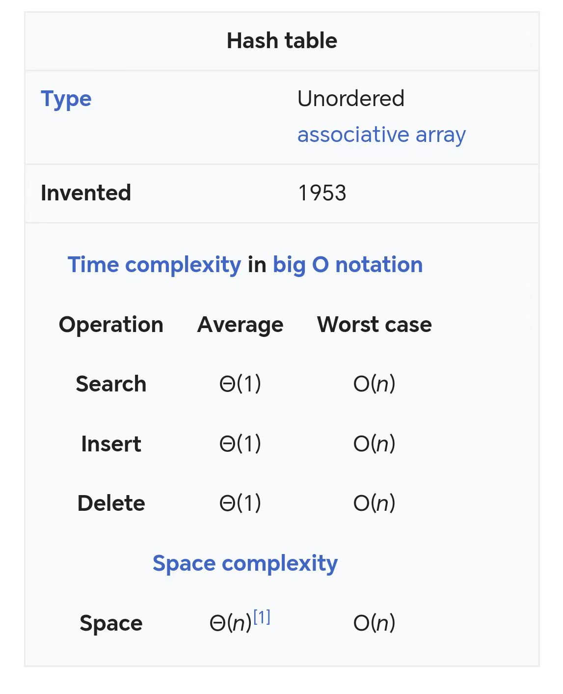

## 含义

加密，将一个东西加密伪装的过程是hash function（或者是散列函数）。得到的结果是hash sum。

- 密码学

散列函数：A通过计算变成B，例如，A是明文，A变成ASCII码变成B。A变成ASCII码就是hash function的过程。加密出来的东西是密文，hash function就是密钥。

散列值碰撞（hash碰撞）：
- 两个人都碰巧伪装成X。

- 单向散列函数
可以通过f(1)用123推到456，然后会再给一个f(2),可以通过f(2)用789（111，456，等等）查到456，但是不会告诉你f(1)。只能通过计算进行查询碰撞，但无法通过f(2)推导出明文。无法通过密文推导出明文。

f(2)是验证的算法，f(1)是解密的方法。

## hash table (hash map)

一个东西通过function（计算）得出一个值，这个值是地址，值就被放在这个地址中。（和索引差不多，速度取决于function的设计）

$key_1$->value1
$key_2$->value1,于是发生碰撞，有些高级语言会将其变成一个链表， 还有其他方式。

最坏的情况是：O(N)
原因：多碰撞几次，hash表一直加。
遍历的时间变长了（跟链表贴近）

用时间戳进行hash运算，时间戳非常难发生碰撞。（时间戳转换工具）
因为时间戳是唯一的（根据时间来的）

## 在C语言中使用第三方hash函数

[leecode中使用到的哈希表UThash配置及使用方法](https://blog.csdn.net/HowToLearnJava/article/details/121546906)
