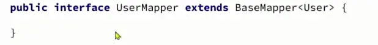
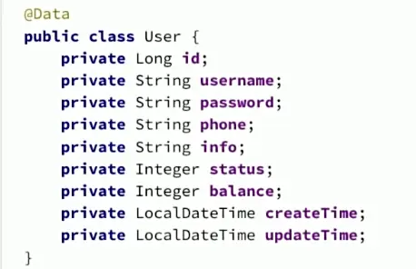
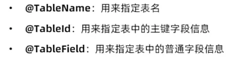
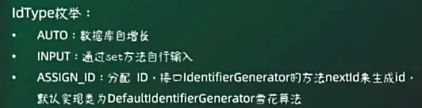
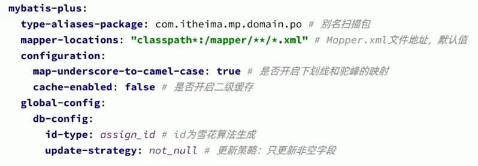
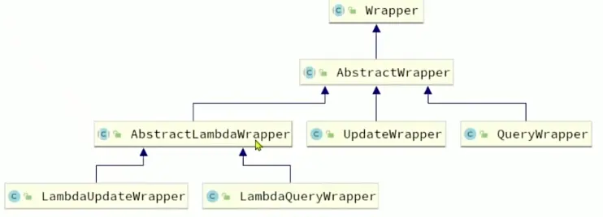
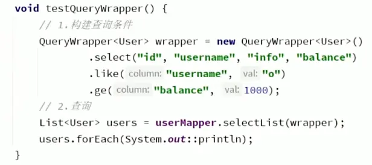
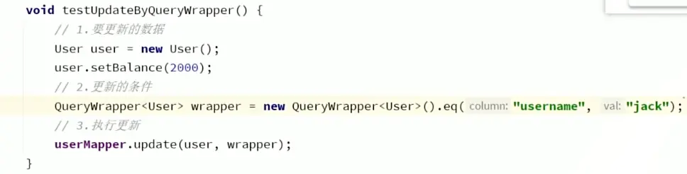
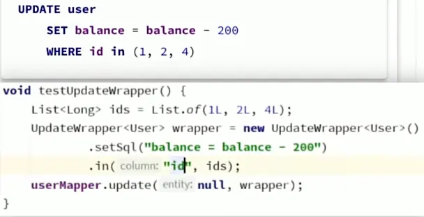
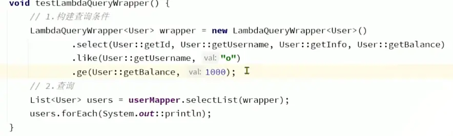

## 引入依赖 和 使用
```xml
<!-- Source: https://mvnrepository.com/artifact/com.baomidou/mybatis-plus-boot-starter -->
<dependency>
    <groupId>com.baomidou</groupId>
    <artifactId>mybatis-plus-boot-starter</artifactId>
    <version>3.5.17</version>
</dependency>
```

- 定义
	- 泛型为对应表
	- 

- 特点
	- 只针对单表
	- 多表需要配置


- 表转换
	- 类名驼峰下划线作为表名
	- 名为 id 的字段作为主键
	- 变量名驼峰转下划线作字段名
	- 
		- createTime-->create_time
	- 布尔类型 is 开头的会自动去掉 is


## 常用注解和配置
- 假如表名和类名不一致，使用注解
	- 
	- `@TableId("id", type=IdType.AUTO)`
	- `@TableName("tb_user")`
- 假如是布尔类型，需要注意 is
	- 使用 `@TableField("is_married")`
- 和数据库关键字冲突，加转义字符
	- ```@TableField("`order`") ```
- 数据库中不存在该字段
	- `@TableField(exist = false)`
		- 表示该字段不存在

- IdType 枚举
	- 
	- 分配 id 的策略

- 配置
	- 


## 条件构造器
- 

- queryWrapper
	- 支持复杂的 where 条件
		- 
	
	- 支持更新
		- 
	

- UpdateWrapper
	- 

- LambdaQueryWrapper
	- 
	- 采用反射机制
	- 避免硬编码

## 自定义 SQL
- 用 Wrapper 完成条件语句书写
- 其他部分自定义


